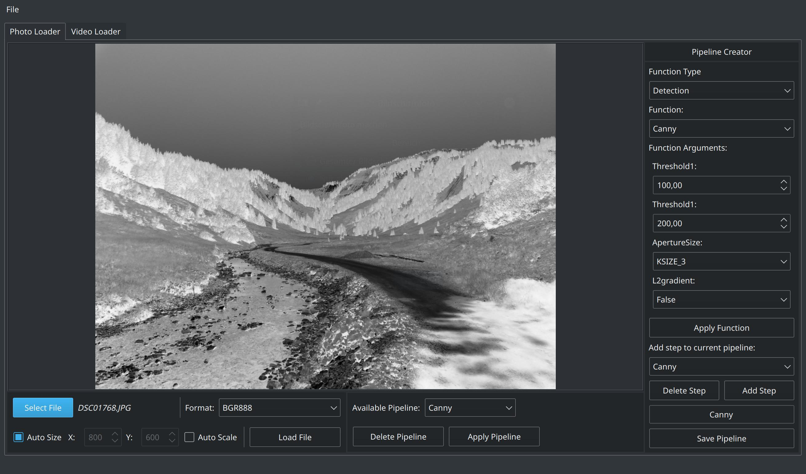
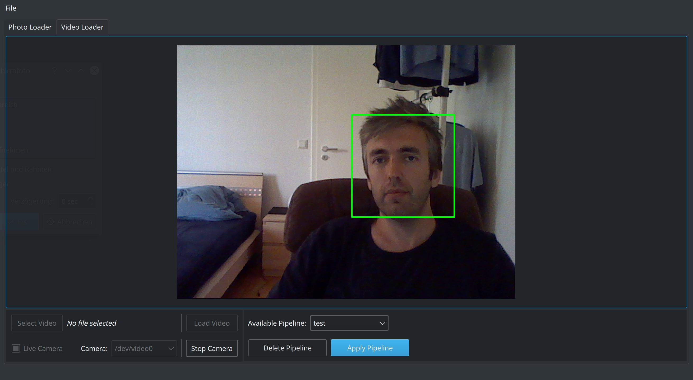
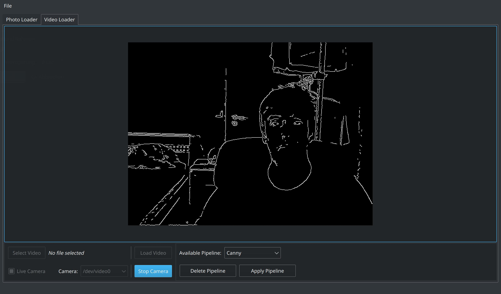

# QtObjectDetector - OpenCV pipeline creator and object detector

This is a Qt/C++ application designed for interaction with OpenCV. It allows the creation of a basic pipeline that can be deployed to images or videos. Currently, you can utilize 16 OpenCV functions along with almost all parameters associated with these functions. The supported functions include CvtColor, Threshold, AdaptiveThreshold, MedianBlur, Blur, GaussianBlur, BitwiseNot, Pow, Erode, Sobel, Laplacian, Canny, AddWeighted, Cascade Classifier, Shi-Tomasi, and Background Subtraction.

An example showcases face detection using cascade classifiers. Your own classifiers should be placed in the 'data/haarcascades' folder.

Another example demonstrates the Canny function/pipeline applied to a live cam, where the function is employed to detect edges.

The workflow should follow these steps:

1. Load a picture, select a function, modify the parameters, and apply it to the loaded picture. Immediately observe the changes. If satisfied, store the step. Choose a different function and repeat the process.
2. Once done adding steps, name the pipeline and save it. Optionally, create multiple pipelines by repeating the steps.
3. After completing your pipeline, apply it to any picture by loading a new picture and clicking 'Apply Pipeline.' For video or webcam application, switch to a different tab (Video Tab), start a video or webcam, and then select and load the pipeline.

Unfortunately, creating the pipeline on-the-fly (while the video is playing or webcam is active) is not possible at the moment. There might be a change in the distant future, but it is unlikely due to the need to address existing bugs. As you know, time is money, and I don't have money :-)
